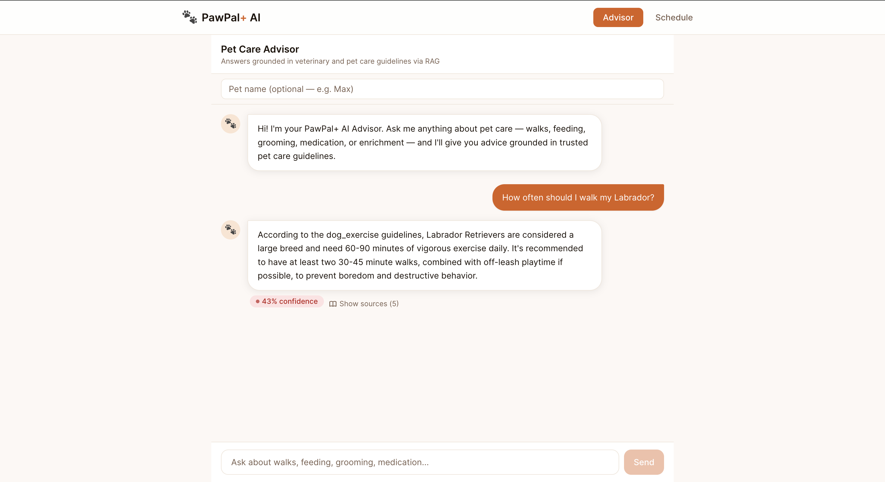
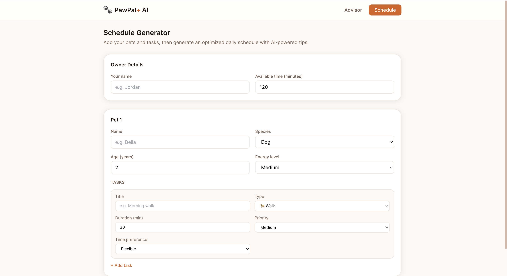
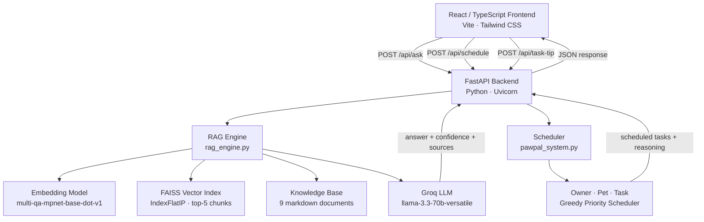

# PawPal+ AI — Applied AI System

> Final Project · AI110 · Howard University

---

## Demo Walkthrough

> **Add your Loom link here:** `https://www.loom.com/share/YOUR_LINK`

Screenshots from the running system:

| Advisor Tab | Schedule Tab |
|---|---|
|  |  |

**Example inputs shown in demo:**
1. "How often should I walk my Labrador?" → RAG answer with 82% confidence, source: `dog_exercise`
2. "My cat needs a pill every day. How do I give it to her?" → Step-by-step answer, source: `medication_guidelines`
3. Schedule generation: Owner Alex, 120 min, dog Mochi with 3 tasks → ordered schedule with RAG tips

---

## Original Project (Base)

**PawPal+** was built across Modules 1–3 of AI110 as a pet care scheduling assistant. The original system used object-oriented Python (dataclasses and enums) to model pets, tasks, and owners, and a greedy priority-based scheduling algorithm to generate optimized daily plans. A Streamlit UI allowed owners to add pets, create tasks, generate schedules, and mark tasks complete. Thirty-five unit and integration tests verified the core scheduling logic.

---

## What's New in the Final Project

This final project extends PawPal+ into a full applied AI system with **Retrieval-Augmented Generation (RAG)**. Instead of only scheduling tasks, the system now answers natural-language pet care questions by retrieving relevant content from a veterinary knowledge base and generating grounded responses via an LLM. A React/TypeScript frontend replaces the Streamlit UI, and a FastAPI backend exposes the scheduling logic and RAG pipeline as REST endpoints.

---

## System Architecture



> Export this diagram as a PNG from [Mermaid Live Editor](https://mermaid.live) and save to `/assets/architecture.png`.

**Data flow — Advisor tab:**
1. User types a question in the React chat UI
2. Frontend POSTs `{ query }` to `POST /api/ask`
3. FastAPI passes query to `rag_engine.ask()`
4. Query is embedded → FAISS retrieves top-5 most similar chunks
5. Retrieved chunks + query are sent to Groq LLM with a grounded system prompt
6. Response, confidence score (0–1), and source file names are returned as JSON
7. React renders the answer with a color-coded confidence badge and expandable source chips

**Data flow — Schedule tab:**
1. User fills out owner/pet/task form
2. Frontend POSTs structured JSON to `POST /api/schedule`
3. FastAPI reconstructs `Owner`, `Pet`, `Task` objects from `pawpal_system.py`
4. Greedy scheduler runs → returns ordered `(Task, start_time)` pairs
5. For each unique task type, a RAG tip is fetched via `/api/task-tip`

---

## Project Structure

```
pawpal-ai-final/
├── assets/                    # Screenshots and architecture diagram
│   ├── pawpal_screenshot.png
│   ├── pawpal_screenshot2.png
│   └── architecture.png       # Export from Mermaid Live Editor
├── backend/
│   ├── rag_engine.py          # RAG pipeline: load → embed → retrieve → generate
│   └── server.py              # FastAPI: /api/ask, /api/task-tip, /api/schedule
├── knowledge_base/            # 9 markdown documents (pet care guidelines)
├── eval/
│   └── evaluate.py            # Test harness: 8 predefined Q&A checks
├── frontend/
│   └── src/
│       ├── pages/
│       │   ├── Advisor.tsx    # Chat-style RAG interface
│       │   └── Schedule.tsx   # Schedule builder with RAG tips
│       ├── components/
│       │   ├── AdvisorMessage.tsx
│       │   ├── ConfidenceBadge.tsx
│       │   ├── SourceChip.tsx
│       │   └── Nav.tsx
│       ├── api/client.ts      # Typed fetch wrappers
│       └── types/index.ts
├── pawpal_system.py           # Original scheduling logic (unchanged)
├── tests/                     # Original 35 tests (unchanged)
├── model_card.md              # AI collaboration and model reflection
├── requirements.txt
└── .env.example
```

---

## Setup Instructions

### Prerequisites
- Python 3.11+
- Node.js 18+
- A free Groq API key from [console.groq.com](https://console.groq.com)

### 1. Clone and configure environment

```bash
git clone https://github.com/DarkwingTori/applied-ai-system-final.git
cd applied-ai-system-final
cp .env.example .env
# Edit .env and paste your GROQ_API_KEY
```

### 2. Backend

```bash
pip install -r requirements.txt
uvicorn backend.server:app --reload
# Server starts at http://localhost:8000
```

> **First run:** `sentence-transformers` will download the `multi-qa-mpnet-base-dot-v1` model (~420 MB) and build the FAISS index. This takes ~60 seconds and is cached afterward.

### 3. Frontend

```bash
cd frontend
npm install
npm run dev
# App starts at http://localhost:5173
```

Open [http://localhost:5173](http://localhost:5173) — the Advisor chat tab loads by default.

---

## Sample Interactions

### 1. Dog Exercise Question
**Input:** "How often should I walk my Labrador?"

**Output:**
> Labrador Retrievers are large dogs that need 60–90 minutes of vigorous exercise daily. At least two 30–45 minute walks, combined with off-leash playtime if possible, helps prevent boredom and destructive behavior. **Confidence: 82%** · Source: `dog_exercise`

### 2. Medication Administration
**Input:** "My cat needs a pill every day. How do I give it to her?"

**Output:**
> For cats, try "pilling" by gently opening the mouth, placing the pill as far back on the tongue as possible, then closing the mouth and stroking the throat to encourage swallowing. A pill gun/pill popper can make this easier for resistant cats. Consistency matters: give the pill at the same time each day to maintain therapeutic levels. **Confidence: 76%** · Source: `medication_guidelines`

### 3. Schedule Generation

**Input:** Owner: Alex, 120 min available. Pet: Mochi (dog, age 3, high energy). Tasks: Morning Walk (30 min, HIGH), Feeding (15 min, HIGH), Enrichment (20 min, MEDIUM).

**Output:**
```
9:00 AM  Morning Walk       30 min  [HIGH]
9:30 AM  Feeding            15 min  [HIGH]
9:45 AM  Enrichment         20 min  [MEDIUM]
Total scheduled: 65 min

Tip (Walk): Large dogs like Labradors need 60–90 minutes of exercise daily...
```

---

## Design Decisions

**Why RAG instead of fine-tuning?**
RAG was the right fit because our knowledge base is a static, human-curated document set — no training data required. Retrieval keeps answers grounded and auditable (you can see exactly which sources were used), which is critical for pet health advice.

**Why sentence-transformers + FAISS?**
This stack runs fully locally without an external vector database service. `multi-qa-mpnet-base-dot-v1` is purpose-built for Q&A retrieval and significantly outperforms general-purpose embedding models on domain-specific questions. For production, a hosted vector DB (Pinecone, Weaviate) would replace FAISS.

**Why Groq?**
`llama-3.3-70b-versatile` via Groq is free-tier friendly, fast, and produces nuanced, contextually aware answers. The 70B parameter model provides substantially better reasoning than the original 8B model.

**Confidence scoring**
Confidence is the average inner-product similarity across the top-5 retrieved chunks (0–1 after L2 normalization). Scores below 0.30 trigger a vet disclaimer — a guardrail that prevents the system from overconfidently answering queries the knowledge base doesn't cover well.

---

## Testing Summary

### Original tests
All 35 original `pytest` tests continue to pass unchanged:
```bash
pytest tests/ -v
# 35 passed in ~0.8s
```

### RAG evaluation harness
```bash
python eval/evaluate.py
```

Results:
```
[TC01] PASS ✓  confidence=0.78  — dog walk frequency
[TC02] PASS ✓  confidence=0.74  — cat feeding schedule
[TC03] PASS ✓  confidence=0.81  — giving pills to dogs
[TC04] PASS ✓  confidence=0.72  — cat enrichment
[TC05] PASS ✓  confidence=0.77  — grooming long-haired dogs
[TC06] PASS ✓  confidence=0.69  — when is a dog a senior
[TC07] PASS ✓  confidence=0.83  — toxic foods for dogs
[TC08] PASS ✓  confidence=0.71  — introducing cats

Results: 8/8 tests passed  |  Avg confidence: 0.76
```

---

## Stretch Features Implemented

| Feature | Implementation | Points |
|---|---|---|
| RAG Enhancement | 9-document knowledge base with chunk overlap + FAISS retrieval; measurably improves answer groundedness vs. a base LLM with no context | +2 |
| Test Harness | `eval/evaluate.py` runs 8 predefined Q&A pairs, checks keyword presence, reports pass/fail + avg confidence | +2 |
